**[View Portfolio →](https://agusarya.vercel.app)**

 

### Hey, I'm Agus 👋

I'm a software engineer based in Denpasar, Bali. I work across recruitment-tech platforms - from candidate-facing career sites to internal HRMS tooling - shaping the product, building the system, and shipping the release.

I enjoy taking a feature from "here's the requirement" to a working, responsive product in production: designing the flow, building the frontend and backend, and making sure it holds up for real users at scale.

### What I Build

- **Full-stack product engineering** - from responsive UI to backend services, database design, and deployment.
- **Enterprise recruitment platforms** - career sites, applicant tracking, employer dashboards, HRMS/HRIS modules.
- **Partner integrations** - Mini Program/WebView integrations, SSO, JS Bridge, and platform-specific compliance work.
- **Internal tooling** - reusable HRMS product packages used across multiple clients.

### Selected Work

| Project | What I built | Status |
|---|---|---|
| **Bursa Kerja Mitra Gojek** | Large-scale recruitment platform connecting Gojek driver partners with employment opportunities - career site, job discovery, application tracking, employer-facing ATS Lite. | Ongoing · 2025 |
| **DANA Mini Program Integration** | Full recruitment service integration within DANA Indonesia's Mini Program ecosystem - job listings, candidate flow, employer dashboard, WebView + JS Bridge. | Completed · 2024 |
| **TikTok HRMS & ATS Lite** | Recruitment platform for TikTok users - job management, applicant tracking, employer dashboard, TikTok SSO authentication. | Completed · 2024 |
| **DECA / TKG** | HRMS, Careersite, and HRIS with KPI tracking for enterprise clients. | Completed · 2024 |
| **LSI Superindo V6** | HRMS V6 implementation for a large-scale enterprise client. | Completed · 2025 |

### Selected Highlights

- **GPA 3.98 / 4.00** - Informatics Engineering, Udayana University.
- **Chief Executive, HIMAIF Udayana University** - led an organization of 50+ members.
- **1st Place, LKMM-TL** - leadership management training competition.
- Contributed to enterprise-scale platforms across **5+ companies and collaborations**.

### What I'm Exploring

I'm interested in the systems side of recruitment tech - how a platform holds up when it's serving multiple enterprise partners (Gojek, DANA, TikTok) on shared infrastructure, and how to keep shipping fast without breaking what's already in production.

Most of that shows up as refactors, internal tooling, and the unglamorous work of making a codebase easier to extend the fifth time, not just the first.

### Tools I Use

  

### Contribution Trail

<picture>
  <source media="(prefers-color-scheme: dark)" srcset="https://raw.githubusercontent.com/agusarya592/agusarya592/output/github-contribution-grid-snake-dark.svg" />
  <source media="(prefers-color-scheme: light)" srcset="https://raw.githubusercontent.com/agusarya592/agusarya592/output/github-contribution-grid-snake.svg" />
  
</picture>

 
 

Building enterprise-scale systems with passion and precision.

 
 

